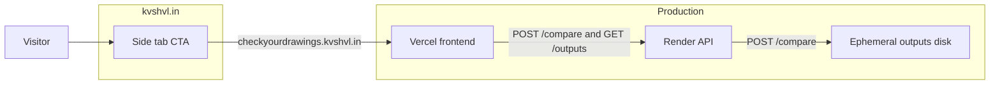

# Check Your Drawings — Master Plan

Canonical plan for the repo. AEC coordination tool for comparing two architectural drawing PDFs. Upload Drawing A and Drawing B (plotted or exported from your design software), auto-align them, and download a coordination overlay PNG.

**Work one task at a time** (see frontmatter todos). **4 tasks remain** for Pass 2.

---

## kvshvl.in brand shell (Pass 2)

Check Your Drawings should look like **kvshvl.in / Clean Paws** — same colors, typography, and page chrome.

### Jekyll `_layouts` vs React (important)

| Repo | Stack | Layout mechanism |
|------|-------|------------------|
| **cleanpaws** | Jekyll static site | [`_layouts/default.html`](../cleanpaws/_layouts/default.html) — inline CSS + `<main>` + `<footer>` |
| **checkyourdrawings** | React + Vite SPA (Vercel) | **No `_layouts/` today** — UI is `frontend/src/App.tsx` + `styles.css` |

**Vercel deploys `frontend/` only.** A Jekyll `_layouts` folder at repo root would **not** wrap the compare app. Pinterest verify HTML (`pinterest-bdc46.html`) and root `_config.yml` are leftovers / static utilities, not the live product shell.

**Correct approach:** Port the **cleanpaws layout format** into React:

| cleanpaws `default.html` | CYD equivalent |
|--------------------------|----------------|
| `:root` CSS variables | `frontend/src/styles.css` |
| `<main>{{ content }}</main>` | `.app-shell` in `App.tsx` |
| `<footer>© year title</footer>` | Footer block in `App.tsx` |
| system-ui font stack | Match kvshvl / cleanpaws |
| Google Analytics in `<head>` | `frontend/index.html` (optional, `G-JTHJJMRHT7` from `_config.yml`) |

**Source of truth for colors:** [`kushalsamant.github.io/assets/css/main.css`](../kushalsamant.github.io/assets/css/main.css) (canonical kvshvl tokens).

**Layout/structure reference:** [`cleanpaws/_layouts/default.html`](../cleanpaws/_layouts/default.html) (`<main>`, `<footer>`, spacing).

> **Note:** Clean Paws inlines CSS variable names that are **swapped** vs kvshvl.in (`--text-muted` is red in cleanpaws; `--accent` is gray). When porting, use **kvshvl.in token meanings**, not cleanpaws variable names literally.

| Token (kvshvl.in) | Value |
|-------------------|--------|
| `--accent` | `#f12345` |
| `--text-primary` | `#888888` |
| `--text-muted` | `#aaaaaa` |
| `--background` | `#ffffff` |

**Keep unchanged:** coordination overlay colors (orange/blue/green/red) — drawing semantics, not UI chrome.

**Optional (not required for Pass 2):** Add `_layouts/default.html` at repo root **only** if you later publish static Jekyll pages from CYD root (e.g. marketing). The compare app itself stays React.

**Task:** `kvshvl-brand-colors` — do **before** `vercel-frontend`.

---

## Overlay semantics

The coordination overlay paints every ink pixel:

| Color | Meaning |
|-------|---------|
| Orange | Ink only in Drawing A |
| Blue | Ink only in Drawing B |
| Green | Ink in both (aligned overlap) |
| Red | Misaligned overlap (clash) |

**Same file twice → mostly green.** That is correct behavior for identical inputs.

---

## Already complete (do not redo)

### Pass 1 — compare product

- PDF pipeline, React UI, FastAPI backend, tests, local smoke on `0A`/`0B`
- Docs: [architecture.md](docs/architecture.md), [smoke-test.md](docs/smoke-test.md), [testing.md](docs/testing.md)

### kvshvl.in marketing

| Item | Status |
|------|--------|
| Side tab CTA → `https://checkyourdrawings.kvshvl.in` | **Live** in [`kushalsamant.github.io/_includes/side-tabs.html`](../kushalsamant.github.io/_includes/side-tabs.html) |
| Repo [`CNAME`](CNAME) | `checkyourdrawings.kvshvl.in` |

### Dev machine setup

| Item | Status |
|------|--------|
| Vercel CLI (`vercel whoami` → `kushalsamant`) | **Done** |
| Render CLI + login | **Done** |
| Render binary | `%LOCALAPPDATA%\Programs\cli-bin\render.exe` (user PATH) |

### Repo config and dependencies (former `production-config` task)

| Item | File | Status |
|------|------|--------|
| `gunicorn` + Pass 3 deps | [backend/requirements.txt](backend/requirements.txt) | **Done** |
| Dual `Settings` + bypass flags | [backend/app/config.py](backend/app/config.py) | **Done** — defaults: `auth_required=false`, `storage_bypass=true` |
| Production env docs | [`.env.example`](.env.example), [frontend/.env.example](frontend/.env.example) | **Done** |
| `/health` + `/health/ready` | [backend/app/main.py](backend/app/main.py) | **Done** |
| `VITE_API_BASE_URL` production build path | [frontend/src/services/api.ts](frontend/src/services/api.ts) | **Done** |

### Optional auth/storage code (landed, **not enabled** — Pass 3)

Code exists but is **off by default**. Pass 2 deploy does **not** need platform DB or Supabase env vars.

| Area | Files |
|------|-------|
| JWT + deps + subscription utils | `backend/app/auth/`, `backend/app/subscription/` |
| Platform DB + models | `backend/app/database.py`, `backend/app/models/` |
| Supabase storage + compare metadata | `backend/app/services/storage.py`, wired in [compare.py](backend/app/routes/compare.py) |
| Supabase migration | [supabase/migrations/20260617015123_create_cyd_outputs_bucket.sql](supabase/migrations/20260617015123_create_cyd_outputs_bucket.sql) |
| Frontend auth (only shows if `VITE_SUPABASE_*` set) | `frontend/src/lib/auth-provider.tsx`, `frontend/src/pages/AuthCallback.tsx`, `@supabase/supabase-js` |

**Production defaults for free hosted MVP** (set on Render / leave unset on Vercel):

```
CYD_AUTH_REQUIRED=false
CYD_STORAGE_BYPASS=true
CYD_CORS_ORIGINS=https://checkyourdrawings.kvshvl.in,https://www.checkyourdrawings.kvshvl.in
```

Do **not** set `PLATFORM_DATABASE_URL`, `SUPABASE_*`, or `VITE_SUPABASE_*` until Pass 3.

---

## Repository layout

| Path | Purpose |
|------|---------|
| `backend/` | FastAPI app, compare pipeline, tests |
| `frontend/` | React UI |
| `docs/` | Architecture, testing, smoke-test docs |
| `supabase/` | Pass 3 migrations (not required for Pass 2 deploy) |
| Root config | `checkyourdrawings.plan.md`, `LICENSE`, `Dockerfile`, `.gitignore`, `.env.example` |

**Local-only at repo root (gitignored):** smoke PDFs `0A`/`0B`, `.env`

**Root leftovers (not part of Vercel SPA deploy):** `_config.yml` (stale `baseurl: "/kushalsamant.github.io"`), `pinterest-bdc46.html` (Pinterest domain verify)

---

## Local development

```powershell
# Terminal 1 — API
cd C:\Users\ADMIN\Documents\GitHub\checkyourdrawings
.\.venv\Scripts\Activate.ps1
pip install -r backend/requirements.txt
uvicorn backend.app.main:app --reload

# Terminal 2 — UI
cd frontend
npm install
npm run dev
```

Open **http://127.0.0.1:5173**. Leave `VITE_API_BASE_URL` unset (Vite proxies `/compare` and `/outputs`).

### Environment variables

**Backend (`CYD_` prefix)** — see [`.env.example`](.env.example). Key production var:

| Variable | Pass 2 production value |
|----------|-------------------------|
| `CYD_CORS_ORIGINS` | `https://checkyourdrawings.kvshvl.in,https://www.checkyourdrawings.kvshvl.in` |

**Frontend** — see [frontend/.env.example](frontend/.env.example):

| Variable | Pass 2 production value |
|----------|-------------------------|
| `VITE_API_BASE_URL` | `https://api.checkyourdrawings.kvshvl.in` (or Render URL until custom domain) |

---

## Pass 2 — Hosted MVP (current work)

**Goal:** Ship the free compare tool to `checkyourdrawings.kvshvl.in`. No login, no billing.

**What's still missing:** deploy artifacts + live hosting + hosted smoke test.

| Still needed | Status |
|--------------|--------|
| kvshvl.in brand shell in React | **Done** |
| [Dockerfile](Dockerfile) + [render.yaml](render.yaml) | **Done** — apply blueprint on Render dashboard |
| [frontend/vercel.json](frontend/vercel.json) | **Done** — preview deployed; set `VITE_API_BASE_URL` + custom domain |
| Live deploy + DNS | **Manual** — see [docs/deploy.md](docs/deploy.md) |
| Hosted smoke doc section | **Done** — [docs/smoke-test.md](docs/smoke-test.md) |

### Production architecture



| Service | Host | Role |
|---------|------|------|
| Frontend | Vercel → `checkyourdrawings.kvshvl.in` | Static Vite build |
| API | Render → `api.checkyourdrawings.kvshvl.in` | FastAPI + OpenCV + PyMuPDF |
| Storage | Render ephemeral disk | `backend/outputs/` — pruned after 24h |

**Reference:** [`sketch2bim/render.yaml`](../sketch2bim/render.yaml) for gunicorn pattern only.

### Pass 2 tasks (remaining)

#### 0. kvshvl brand shell (`kvshvl-brand-colors`)

Port [`cleanpaws/_layouts/default.html`](../cleanpaws/_layouts/default.html) format into the React app (not a Jekyll `_layouts` folder for the SPA):

- [frontend/src/styles.css](frontend/src/styles.css) — kvshvl `:root` tokens; replace slate/green hex values
- [frontend/src/App.tsx](frontend/src/App.tsx) — match cleanpaws `<main>` + `<footer>` structure
- [frontend/index.html](frontend/index.html) — meta description, optional GA tag from `_config.yml`
- Visual check at `http://127.0.0.1:5173` before deploy

#### 1. API on Render (`dockerfile-render`)

- Replace placeholder [Dockerfile](Dockerfile): `python:3.12-slim`, OpenCV system libs, `gunicorn` + uvicorn worker, `--timeout 300`
- Create `render.yaml` with `healthCheckPath: /health`
- Render env vars:
  - `CYD_CORS_ORIGINS=https://checkyourdrawings.kvshvl.in,https://www.checkyourdrawings.kvshvl.in`
  - `CYD_AUTH_REQUIRED=false`
  - `CYD_STORAGE_BYPASS=true`
- Connect repo on Render; deploy API

#### 2. Frontend on Vercel (`vercel-frontend`)

- Add `vercel.json` (or configure in dashboard): root `frontend`, build `npm run build`, output `dist/`
- Env at build time: `VITE_API_BASE_URL=<Render API URL>`
- Connect repo on Vercel; add custom domain `checkyourdrawings.kvshvl.in`

**DNS:**

| Record | Points to |
|--------|-----------|
| `checkyourdrawings.kvshvl.in` | Vercel |
| `api.checkyourdrawings.kvshvl.in` | Render |

Can ship with `*.onrender.com` API URL first, then add API custom domain.

#### 3. Hosted smoke test (`hosted-smoke`)

Add section to [docs/smoke-test.md](docs/smoke-test.md):

1. Open [kvshvl.in](https://www.kvshvl.in) → **Check Your Drawings** side tab
2. Upload `0A` / `0B` → Compare → overlay renders
3. Download PNG works
4. `curl https://api.../health` → `{"status":"ok"}`

**Estimated effort:** ~1 day (deploy files + dashboard setup + smoke).

---

## Pass 3 — Enable auth and cloud storage (later, only if needed)

Most code is **already in the repo**. Pass 3 is about **turning it on**, not building from scratch. **Do not delete** auth, subscription, or storage code when shipping Pass 2.

- Set `CYD_AUTH_REQUIRED=true`, `CYD_STORAGE_BYPASS=false` on Render
- Set `PLATFORM_DATABASE_URL`, `SUPABASE_*` on Render; `VITE_SUPABASE_*` on Vercel
- Run Supabase migration; configure OAuth redirect URLs
- kvshvl subscription gate (402) — reads platform `users` table; **no Razorpay in CYD** (checkout stays on kvshvl.in or can change provider on platform without rewriting compare pipeline)

**Payment flexibility:** CYD only checks `subscription_status` + `subscription_expires_at`. Swapping checkout provider or per-app pricing is a **platform** change; the 402 gate stays as-is.

Other growth: team features, analytics, DWG/raster inputs.

---

## Dropped / complete (do not resurrect)

| Former plan | Status |
|-------------|--------|
| Pass 1 smoke test | Done |
| Red → orange / magenta → red clash | Shipped |
| kvshvl.in side tab CTA | Done |
| Config + gunicorn + `.env.example` | Done |
| Auth/storage code scaffold | Done (disabled by default) |
| Full Sketch2BIM SaaS port | Declined |
| CLI install + login | Done |

---

## References

- Architecture: [docs/architecture.md](docs/architecture.md)
- kvshvl site: [`../kushalsamant.github.io`](../kushalsamant.github.io)
- Sketch2BIM deploy reference: [`../sketch2bim/render.yaml`](../sketch2bim/render.yaml)
