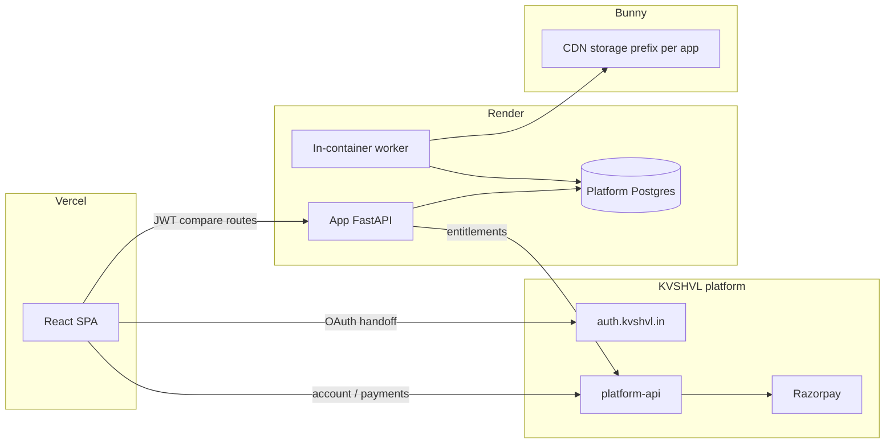

# KVSHVL app template

Reusable pattern for shipping a new product on the KVSHVL platform. **Check Your Drawings** is the reference implementation.

## Architecture

## Repos

| Repo | Role |
|------|------|
| `auth` | Google OAuth, issues platform JWT |
| `platform-api` | Users, subscriptions, Razorpay webhooks, entitlements |
| `<app>` (e.g. `checkyourdrawings`) | Product only — no Razorpay, no user DB |

## New app checklist

### 1. Naming

| Context | Example |
|---------|---------|
| User-facing product name | Check Your Drawings |
| Repo | `checkyourdrawings` |
| Render service | `checkyourdrawings-api` |
| Entitlement slug | `GET /entitlements?app=checkyourdrawings` |
| Bunny prefix | `checkyourdrawings/` |

Do not use legacy abbreviations in new apps.

### 2. Frontend (Vercel)

- GoDaddy DNS: **A** `<app>` → `76.76.21.21` (match `auth`, `coherence`; no `*.vercel-dns-*.com` CNAME on app subdomains)
- React + Vite SPA
- `VITE_KVSHVL_AUTH_URL` → sign-in redirect
- `VITE_PLATFORM_API_URL` → account + checkout
- `VITE_API_BASE_URL` → app backend
- Auth callback: handoff code → `POST {auth}/api/handoff/exchange` → JWT in `sessionStorage`
- Send `Authorization: Bearer <jwt>` on protected app API calls
- Anonymous sessions: `X-Anon-Session` UUID in `localStorage` when optional auth is enabled

Reference: [frontend/src/lib/auth-provider.tsx](../frontend/src/lib/auth-provider.tsx), [frontend/src/services/platform-api.ts](../frontend/src/services/platform-api.ts)

### 3. Backend (Render)

- FastAPI + Docker
- `PLATFORM_JWT_SECRET` / `PLATFORM_JWT_ISSUER` — verify tokens from auth
- `PLATFORM_API_URL` — `GET /entitlements?app=<slug>` for tier/priority
- `PLATFORM_DATABASE_URL` — shared Postgres for app tables (jobs, etc.)
- Async jobs: `POST` → `job_id`, poll `GET /jobs/{id}`
- Worker in same container (`FOR UPDATE SKIP LOCKED` queue)
- Migrations on deploy: `python scripts/migrate.py` before gunicorn

Reference: [backend/app/main.py](../backend/app/main.py), [backend/app/services/job_worker.py](../backend/app/services/job_worker.py)

### 4. Bunny

- Env: `BUNNY_STORAGE_ZONE`, `BUNNY_STORAGE_ACCESS_KEY`, `BUNNY_CDN_HOSTNAME`, `BUNNY_TOKEN_AUTH_KEY`
- Upload under `BUNNY_STORAGE_PREFIX/<app>/`
- Signed URLs (~24h TTL)
- Prune on startup + job retention

Reference: [backend/app/services/bunny_storage.py](../backend/app/services/bunny_storage.py)

### 5. Billing

- **Only on platform-api** — frontend calls `/payments/plans`, `/payments/checkout`
- App backend uses entitlements for queue priority / limits — not for payment

Reference: [frontend/src/services/pricing.ts](../frontend/src/services/pricing.ts)

### 6. Deploy

| Target | Tool |
|--------|------|
| Render API | `scripts/deploy_render_env.py` + `render deploys create` |
| Vercel frontend | `vercel` CLI |
| Postgres | `render ea pg` (CLI only) |

`render.yaml` is reference documentation — provision via CLI, not Blueprint sync.

### 7. CI

- GitHub Actions: Postgres service, `migrate.py`, `pytest`, `npm test`
- Reference: [.github/workflows/ci.yml](../.github/workflows/ci.yml)

## Copy from checkyourdrawings

When starting app #2, copy and adapt:

1. `migrations/` + `scripts/migrate.py`
2. `backend/app/auth/` (JWT deps)
3. `backend/app/services/platform_client.py`
4. `backend/app/services/job_queue.py` + `job_worker.py`
5. `backend/app/services/bunny_storage.py`
6. `scripts/deploy_render_env.py`
7. `vercel.json` + frontend auth/platform service modules

Replace compare-specific code (`comparison_pipeline.py`, etc.) with your product logic.

## Environment variables

See [env.example](../env.example) for the full list. Minimum for a networked app:

**Backend:** `PLATFORM_DATABASE_URL`, `PLATFORM_API_URL`, `PLATFORM_JWT_SECRET`, `PLATFORM_JWT_ISSUER`, `CORS_ORIGINS`, `BUNNY_*`

**Frontend:** `VITE_API_BASE_URL`, `VITE_PLATFORM_API_URL`, `VITE_KVSHVL_AUTH_URL`, `VITE_BUNNY_CDN_HOSTNAME`
